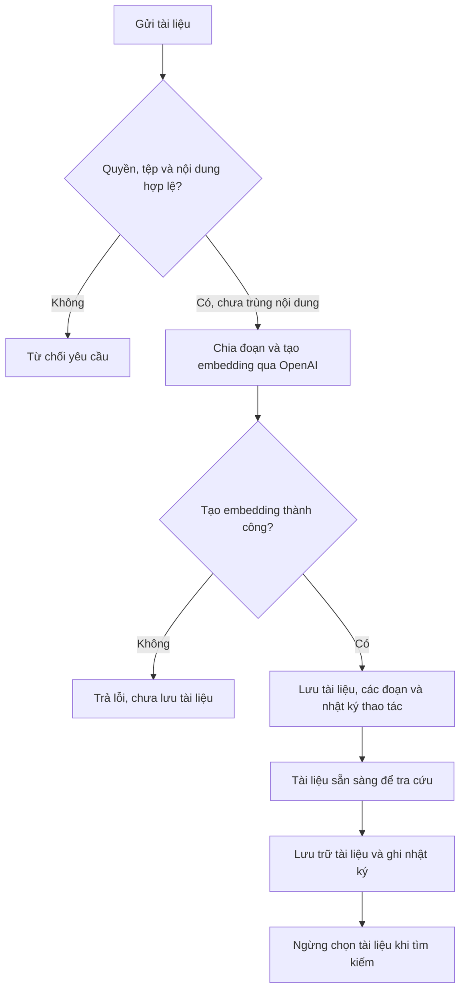

Bạn dùng **Trợ lý AI** trong giao diện quản trị để hỏi về tài liệu nội bộ và tra cứu dữ liệu vận hành của tòa nhà đang chọn. Trợ lý hiển thị câu trả lời, nguồn tham chiếu và cho phép mở lại lịch sử trò chuyện của bạn.

<Info>
  Bạn cần quyền truy cập trợ lý AI. Dữ liệu tra cứu còn phụ thuộc quyền xem từng nhóm nghiệp vụ và tòa nhà đang chọn. Công cụ dữ liệu chỉ đọc, không tạo hoặc sửa dữ liệu nghiệp vụ.
</Info>

## Chỉ mục chức năng

| Bạn cần làm gì? | Nội dung |
| --- | --- |
| Hỏi và mở lại cuộc trò chuyện | [Trò chuyện với trợ lý](/ai/index#trò-chuyện-với-trợ-lý) |
| Thêm tài liệu hoặc ngừng dùng tài liệu | [Kho tri thức](/ai/index#kho-tri-thức) |
| Tìm bản ghi theo quyền của bạn | [Tra cứu dữ liệu vận hành](/ai/index#tra-cứu-dữ-liệu-vận-hành) |
| Gọi công cụ từ ứng dụng AI bên ngoài | [Kết nối MCP](/ai/index#kết-nối-mcp) |
| Đối chiếu khả năng chưa đầy đủ | [Tình trạng tính năng](/reference/release-status#giới-hạn-phần-ai) |

## Trò chuyện với trợ lý

<Frame caption="Bảng điều khiển Trợ lý AI (ChatBot và RAG Knowledge) hiển thị trên thanh công cụ">
  
</Frame>

Trong panel **Trợ lý AI**, chọn **ChatBot**. Một câu hỏi có tối đa 4.000 ký tự.

<Steps>
  <Step title="Gửi câu hỏi">
    Nhập nội dung vào **Hỏi trợ lý AI**, chọn **Gửi** hoặc nhấn Enter. Nhấn Shift + Enter để xuống dòng.
  </Step>
  <Step title="Đọc câu trả lời">
    Khi xử lý xong, giao diện hiển thị câu trả lời bằng Markdown, có thể gồm bảng. **Nguồn tham chiếu** hiển thị mã tài liệu hoặc nhóm dữ liệu được trả về cùng câu trả lời.
  </Step>
  <Step title="Hỏi tiếp hoặc bắt đầu lại">
    Chọn **Lịch sử trò chuyện** để mở cuộc trò chuyện cũ. Chọn nút **Bắt đầu cuộc trò chuyện mới** để nhập câu hỏi trong cuộc trò chuyện mới.
  </Step>
</Steps>

Trong lúc chờ trả lời, nút **Dừng** hủy yêu cầu đang chờ ở giao diện. Khi giao diện xử lý việc hủy, câu hỏi được đưa lại vào ô nhập và hiện thông báo **Đã dừng trả lời.**

## Tình huống thực tế

> **Ví dụ:** Nhân viên ban quản lý cần tra cứu nhanh thông tin dịch vụ của căn hộ:
> 1. Bấm nút **Trợ lý AI** trên thanh tiêu đề góc phải để mở panel trợ lý.
> 2. Đặt câu hỏi: *"Kiểm tra trạng thái nợ của căn hộ A0101 trong kỳ tháng 07/2026?"*
> 3. Trợ lý AI gọi công cụ tra cứu dữ liệu vận hành `TAHO:billing` và trả về chi tiết bảng kê, số tiền còn nợ kèm nguồn trích dẫn rõ ràng.

| Mã nguồn | Ý nghĩa |
| --- | --- |
| `KB:<documentId>#<chunkIndex>` | Một đoạn trong tài liệu kho tri thức. |
| `TAHO:<area>` | Nhóm dữ liệu vận hành được công cụ truy vấn. |

<Note>
  Server kiểm tra mã trích nguồn có thuộc các nguồn được cung cấp cho cuộc trò chuyện hay không. Kiểm tra này không xác minh từng phát biểu đúng với nội dung nguồn.
</Note>

## Kho tri thức

Chọn **RAG Knowledge** để quản lý tài liệu. Tab này chỉ xuất hiện khi bạn có quyền quản lý kho tri thức.

RAG là cách tìm đoạn tài liệu liên quan rồi đưa vào ngữ cảnh để mô hình trả lời. Embedding là biểu diễn số của nội dung, được dùng khi xếp hạng các đoạn tài liệu.

<Steps>
  <Step title="Chọn tài liệu">
    Trong **Thêm tài liệu**, nhập **Tiêu đề**, chọn **Danh mục** và **Chọn tài liệu**. Tiêu đề có từ 1 đến 200 ký tự. Các định dạng được nhận là TXT, MD, CSV, JSON, PDF, DOCX và XLSX; mỗi tệp tối đa 10 MB.
  </Step>
  <Step title="Lập chỉ mục">
    Chọn **Tải lên và lập chỉ mục**. Server trích văn bản, chia đoạn, tạo embedding rồi lưu tài liệu và các đoạn. Khi thành công, tài liệu xuất hiện trong **Thư viện** và giao diện báo đã thêm tài liệu vào kho tri thức của tòa nhà.
  </Step>
  <Step title="Ngừng dùng tài liệu">
    Chọn nút **Lưu trữ** của tài liệu đang hoạt động. Khi thành công, tài liệu hiện **Đã lưu trữ** và không còn được chọn cho lần tìm tài liệu tiếp theo.
  </Step>
</Steps>

Server từ chối tệp không lấy được văn bản, nội dung vượt 1.000.000 ký tự hoặc nội dung trùng với tài liệu đã tải lên trong cùng tòa nhà.

| Trạng thái lưu | Ý nghĩa đối với việc tra cứu |
| --- | --- |
| `ready` | Tài liệu đang hoạt động; các đoạn có thể được chọn để trả lời. |
| `archived` | Tài liệu đã lưu trữ; các đoạn không được chọn khi tìm kiếm. |

## Tra cứu dữ liệu vận hành

Mô hình có thể yêu cầu công cụ `search_taho_records` tìm bản ghi. Server kiểm tra nhóm dữ liệu, quyền truy cập và tòa nhà, sau đó chỉ trả các trường được cho phép. Mỗi lần tìm lấy tối đa 20 bản ghi.

| Nhóm dữ liệu | Nội dung có thể tra cứu |
| --- | --- |
| Căn hộ | Mã, tên, tầng và trạng thái căn hộ. |
| Cư dân | Tên, căn hộ và các trường cư dân được cho phép. |
| Bảng kê | Mã bảng kê, căn hộ, kỳ, số tiền, đã trả và nợ. |
| Công nợ | Khách hàng, căn hộ, dịch vụ và các số dư. |
| Phiếu thu/chi | Mã phiếu, loại phiếu, căn hộ, số tiền và trạng thái. |
| Yêu cầu dịch vụ | Tiêu đề, loại yêu cầu, căn hộ và trạng thái. |

<Info>
  Kết quả tìm bản ghi không phải báo cáo tổng hợp toàn bộ tòa nhà. Xem [giới hạn phần AI](/reference/release-status#giới-hạn-phần-ai) để đối chiếu gợi ý tổng hợp công nợ trên giao diện.
</Info>

## Kết nối MCP

MCP là giao thức để ứng dụng AI bên ngoài gọi công cụ của Taho. Endpoint `/api/mcp` yêu cầu tài khoản được xác thực và có quyền truy cập trợ lý AI.

| Công cụ | Kết quả cung cấp cho ứng dụng bên ngoài |
| --- | --- |
| `search_knowledge` | Các đoạn tài liệu liên quan của tòa nhà đang chọn; tối đa 12 đoạn mỗi lần gọi. |
| `search_taho_records` | Bản ghi vận hành thuộc nhóm được phép; tối đa 20 bản ghi mỗi lần gọi. |

Endpoint trả kết quả công cụ; ứng dụng bên ngoài xử lý hội thoại. Khi không có khóa OpenAI hoặc tạo embedding thất bại, tìm tài liệu qua MCP dùng điểm khớp từ khóa.

## Phạm vi xử lý và lưu dữ liệu

Chat gửi câu hỏi, ngữ cảnh hội thoại, các đoạn tài liệu và kết quả công cụ được dùng tới OpenAI để xử lý. Yêu cầu tạo câu trả lời đặt `store: false`. Taho lưu câu hỏi, câu trả lời, nguồn, model và số token trong PostgreSQL khi luồng trả lời thành công.

Giới hạn chat là 20 yêu cầu/phút và MCP là 60 yêu cầu/phút, tính riêng theo người dùng, tòa nhà và loại yêu cầu.

<Accordion title="Dành cho kỹ thuật">
  `activeTowerId` là tòa nhà đang chọn và là phạm vi cho repository AI cùng truy vấn dữ liệu vận hành.

  - Chat đi qua `POST /admin/ai/chat`, tìm tối đa 6 đoạn tài liệu, lấy tối đa 12 tin nhắn gần nhất khi hỏi tiếp và chạy tối đa 4 lượt gọi mô hình.
  - Kho tri thức đi qua `POST /admin/ai/knowledge`; lưu tài liệu, các đoạn và nhật ký trong cùng transaction. `DELETE /admin/ai/knowledge` chuyển tài liệu từ `ready` sang `archived` và ghi nhật ký trong cùng transaction.
  - `AiKnowledgeDocuments` lưu metadata tài liệu; `AiKnowledgeChunks` lưu văn bản và embedding. `AiChatThreads` lưu cuộc trò chuyện; `AiChatMessages` lưu tin nhắn.
  - Hai tin nhắn hỏi–đáp và thời gian cập nhật cuộc trò chuyện được ghi trong cùng transaction. Việc tạo cuộc trò chuyện mới diễn ra trước transaction đó. Lịch sử chỉ được đọc theo chủ cuộc trò chuyện và tòa nhà.
  - `AiRateLimits` lưu số lượt yêu cầu theo cửa sổ một phút.
</Accordion>

## Tài liệu liên quan

- [Vai trò và phạm vi](/overview/roles-and-scope): quyền tài khoản và tòa nhà đang chọn.
- [Công nợ và thanh toán](/operations/debt-payments): thao tác nghiệp vụ ngoài trợ lý AI.
- [Tình trạng tính năng](/reference/release-status#giới-hạn-phần-ai): giới hạn hiện tại của phần AI.
