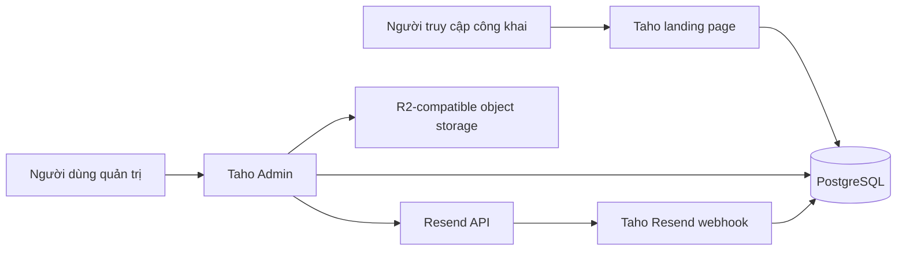
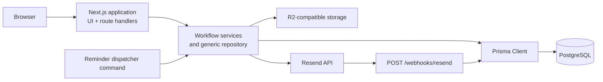
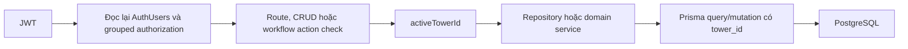

Taho Admin là một ứng dụng Next.js chạy giao diện quản trị và server handlers trong cùng codebase. PostgreSQL là nơi lưu dữ liệu chính; các integration bên ngoài chỉ được gọi qua server code.

## System context

Sơ đồ này chỉ thể hiện actor và hệ thống ngoài được current source gọi trực tiếp.



`app/api/resident/portal/route.ts` cung cấp API cho Resident Mini App. Handler lấy phiên cư dân từ bearer token trong production và gọi `src/modules/resident-miniapp/resident-miniapp.ts` để đọc dữ liệu theo liên kết căn hộ đã duyệt. Xem [Tình trạng tính năng](/reference/release-status) cho bản sửa nghiệp vụ chưa phát hành.

## Runtime containers



Next.js UI và server handlers nằm trong cùng application build. Reminder dispatcher là command riêng; source không xác nhận automatic scheduler gọi command này.

## Trách nhiệm của từng lớp

| Lớp | Trách nhiệm | Vị trí chính |
| --- | --- | --- |
| Giao diện | Hiển thị menu, form, table và trạng thái thao tác | `app/` và React client components |
| Admin route catalog | Khai báo màn hình, nhãn, module, action và field metadata | `src/lib/admin-data.ts` |
| HTTP boundary | Xác thực request, kiểm tra quyền và chuẩn hóa response | `app/**/route.ts` |
| Workflow service | Thực hiện nghiệp vụ nhiều bước trong transaction | `src/modules/*`; phần dùng chung trên server ở `server.ts` |
| Generic repository | Đọc/ghi các module CRUD có validation | `src/modules/admin/admin-repository.ts` |
| Persistence | Chuyển đổi dữ liệu và truy cập PostgreSQL | Prisma, `src/core/db/database-store.ts`, `src/core/db/prisma.ts` |

## Một request đọc dữ liệu đi qua đâu?

```text
Browser
→ app/admin/[[...slug]]/page.tsx
→ app/admin/_routing/render-admin-page.tsx
→ tìm route trong admin-data.ts
→ xác thực phiên và kiểm tra route visibility
→ repository hoặc report query
→ Prisma
→ PostgreSQL
→ render HTML/React UI
```

## Một request ghi dữ liệu đi qua đâu?

```text
Form hoặc client workspace
→ route handler
→ same-origin + authentication
→ route/action/CRUD permission
→ validate input và active tower scope
→ repository hoặc domain service
→ Prisma transaction
→ PostgreSQL và side effect được code chỉ định
→ JSON hoặc redirect notice
```

Không có một write endpoint dùng cho mọi nghiệp vụ:

- `/admin/mutate` xử lý CRUD thông thường.
- `/admin/workflow` xử lý bảng kê, phiếu thu, điều chỉnh và tiền thừa.
- Membership, vehicle, RBAC, import và reminder có handler riêng.

Việc tách handler này quan trọng khi sửa code: route-level `generic` không bảo đảm module được `/admin/mutate` cho phép. Handler vẫn là nơi enforcement cuối cùng.

## RBAC và tenant enforcement

Authentication, authorization và tenant scope là ba bước riêng:



- `src/modules/access/auth.ts` đọc lại account, employee, tower assignments và permission groups cho mỗi authenticated request.
- `src/modules/access/rbac.ts` chỉ quyết định route/action permission; các hàm này không tự thêm tenant filter.
- Handler lấy `user.activeTowerId` và truyền xuống repository hoặc domain service.
- `createAdminRepository()` thêm tower filter cho table có `tower_id`, ghi đè crafted `tower_id` khi create và chặn update/delete chéo tower.
- Specialized services phải tự giữ `towerId` trong mọi query, mutation và relation lookup.
- Không tìm thấy PostgreSQL Row-Level Security policy trong current source code.

<Warning>
  Permission group hiện là global, không gắn với tower. Một user dùng cùng tập permission tại mọi tower trong `allowedTowerIds`. Xem [Permissions matrix](/product-specs/permissions-matrix) trước khi thay đổi authorization hoặc tenant behavior.
</Warning>

## Storage và integration đã quan sát

| Integration | Hành vi trong source |
| --- | --- |
| PostgreSQL | Application persistence qua Prisma adapter |
| R2-compatible object storage | Lưu ảnh bằng chứng meter reading; metadata ở `MeterReadings` |
| Resend | Dispatcher script gửi queued reminder jobs; webhook cập nhật delivery events |
| XLSX/CSV | Import preview/commit và export qua `exceljs` cùng helper nội bộ |
| JWT cookie | Phiên đăng nhập quản trị |

## Deployment runtime

`Dockerfile` build ứng dụng bằng Node 24 Alpine. Runner cài production dependencies, copy `.next`, `public`, Prisma artifacts và chạy `yarn start` dưới user không phải root.

GitHub workflow hiện build image `linux/arm64`, push lên GHCR khi `main` thay đổi ở các path được cấu hình, rồi gọi action deploy CapRover.

Xem [Database](/engineering/database), [Route handlers](/engineering/route-handlers) và [Integrations](/engineering/integrations) cho từng runtime boundary.

## Tìm code theo loại thay đổi

| Khi cần thay đổi | Bắt đầu từ |
| --- | --- |
| Menu, nhãn hoặc form metadata | `src/lib/admin-data.ts` |
| Quyền nhìn thấy route/action | `src/modules/access/rbac.ts`, permission catalog |
| Grouped RBAC hoặc tenant scope | `src/modules/access/grouped-rbac.ts`, `src/modules/access/auth.ts`, `src/modules/admin/admin-repository.ts` |
| Generic validation | `src/modules/admin/admin-repository.ts` |
| Công nợ hoặc phiếu thu | `src/modules/billing/bill-service.ts`, `src/modules/billing/receipt-service.ts` |
| Cư dân–căn hộ | `src/modules/residents/resident-apartment-memberships.ts` |
| Phương tiện | `src/modules/operations/apartment-vehicles.ts` |
| Email nhắc phí | `src/modules/billing/debt-reminders.ts`, `src/core/delivery/email-delivery.ts` |
| Database shape | `prisma/schema.prisma` và migrations |

<Info>
  Tài liệu này không công bố hostname, token, secret hoặc giá trị deployment.
</Info>
