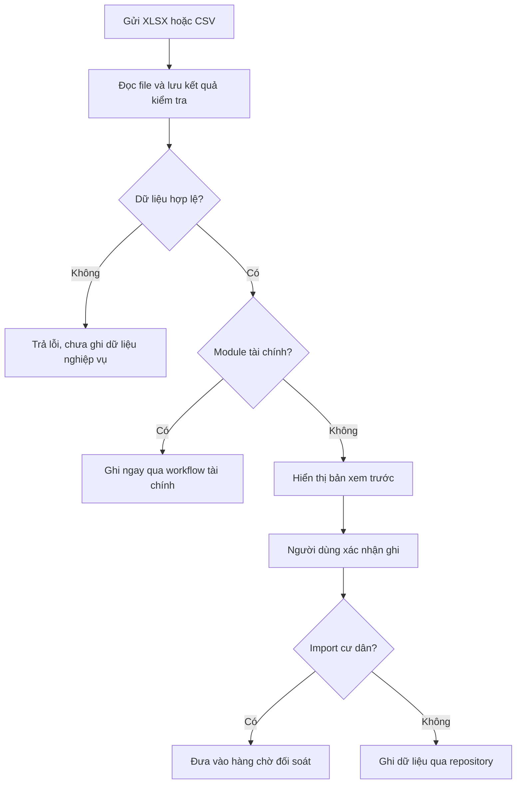

## Import

`POST /admin/import` yêu cầu same-origin, authentication và access tới route lấy từ `returnTo`.

Handler kiểm tra bản xem trước thuộc route và tòa nhà khi ghi dữ liệu. Import thông thường gồm hai bước xem trước và xác nhận. Riêng module tài chính, handler tự gọi `commitFinancialImportPreview()` ngay sau khi kiểm tra file hợp lệ; không chờ thêm thao tác xác nhận trên giao diện.

<Warning>
  **Import bảng kê** có thể ghi dữ liệu ngay khi file hợp lệ. Không áp dụng quy tắc “chọn file rồi chỉ xem trước” của import căn hộ cho màn hình này.
</Warning>

Import cư dân đi qua `commitResidentImportToReconciliation()` để tạo mục chờ đối soát. Thao tác ghi file chưa tự tạo `Residents` hoặc `ResidentApartmentMemberships`.

## Export

`GET /admin/export` nhận `path` để xác định route và module; `moduleKey` được lấy từ cấu hình route. Handler yêu cầu route có module, quyền truy cập và `allowExport !== false`. Xuất người dùng yêu cầu thêm `export_users`.

XLSX branches được tìm thấy cho bill template/list, resident template/list, apartment summary, debt, excess, cashbook và bankbook. Generic modules và một số specialized rows trả CSV.

`mode=qr` trả SVG chứa title và route detail. Không tìm thấy QR encoding workflow. Phân loại: `Placeholder`.

Xem các admin entry points tại [Route catalog](/reference/route-catalog).
