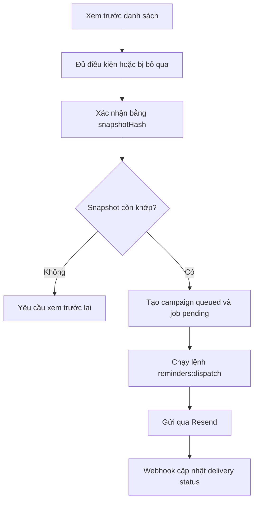

| Tóm tắt | Nội dung |
| --- | --- |
| Trạng thái | Preview, queue, lệnh gửi và webhook: `Implemented`; lịch gửi tự động: `Not Found` |
| Người thực hiện | Tài khoản có quyền gửi nhắc công nợ và đã chọn tòa nhà |
| Kết quả | Tạo campaign và job; email chỉ được gửi khi dispatcher chạy |

## Trước khi thực hiện

- Căn hộ còn công nợ dương theo dữ liệu workflow.
- Có contact đủ điều kiện và billing email consent còn bật.
- Email không nằm trong suppression list.

## Quy trình

## Khi email không được gửi

| Điều kiện | Kết quả |
| --- | --- |
| Dữ liệu thay đổi sau khi xem trước | Queue trả `preview-changed` |
| Contact hoặc consent không còn hợp lệ | Job bị `suppressed` hoặc `skipped` |
| Công nợ không còn dương | Không gửi email |
| Gửi email chưa bật hoặc chưa cấu hình | Dispatcher trả trạng thái disabled |

## Giới hạn hiện tại

Source có lệnh `reminders:dispatch`, nhưng không tìm thấy automatic scheduler gọi lệnh này.

<Accordion title="Dành cho BA, QA và kỹ thuật">
  ### User story

  Với tài khoản có quyền `action:send_debt_reminders`, người dùng có thể xem trước và đưa các email nhắc công nợ đủ điều kiện vào hàng đợi.

  ### Acceptance criteria

  - **Given** snapshot vẫn khớp, **when** xác nhận queue, **then** hệ thống tạo `BillingReminderCampaigns`, `Notifications` và `AuditLogs`.
  - **Given** snapshot đã đổi, **when** xác nhận queue, **then** hệ thống trả `preview-changed`.
  - **Given** dispatcher chạy và cấu hình gửi hợp lệ, **when** job được xử lý, **then** webhook có thể cập nhật trạng thái giao email.

  Preview không ghi campaign. Dispatcher và webhook cập nhật `Notifications`, `NotificationEvents` và có thể cập nhật `EmailSuppressions`.

  Kiểm thử tích hợp nằm trong `test/debt-reminder-integration.test.ts` và `test/resend-webhook.test.ts`.
</Accordion>
