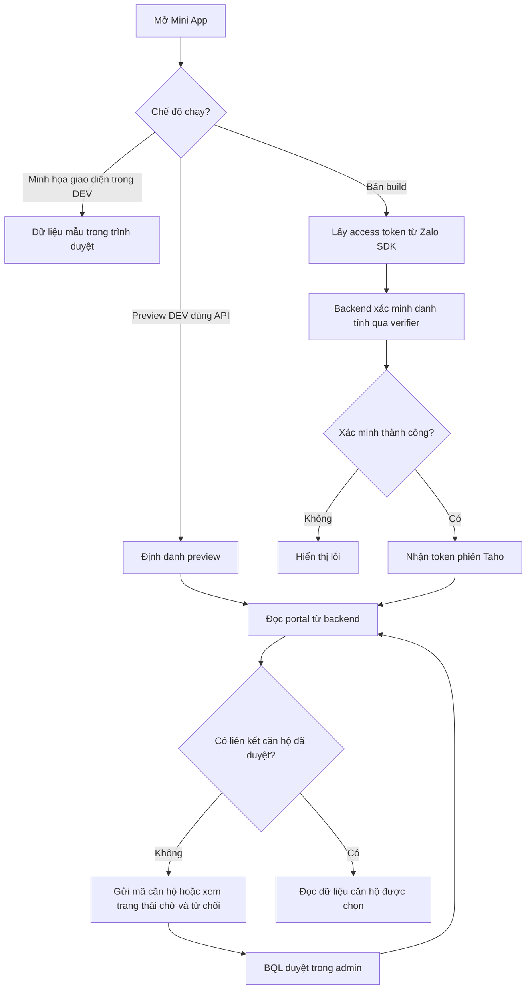

Mini App có bốn màn hình **Trang chủ**, **Bảng kê**, **Yêu cầu** và **Cá nhân**. Cư dân gửi thông tin căn hộ để ban quản lý duyệt quyền trước khi đọc dữ liệu riêng của căn hộ.

## Chọn tài liệu cần đọc

<Columns cols={2}>
  <Card title="Chức năng và cấp quyền" icon="users" href="/operations/resident-miniapp">
    Duyệt, từ chối, thu hồi quyền và phạm vi dữ liệu cư dân được xem.
  </Card>
  <Card title="Chạy Mini App local" icon="terminal" href="/mini-app/local-development">
    Phân biệt bản minh họa giao diện, preview dùng API và bản build dùng Zalo.
  </Card>
  <Card title="API Mini App" icon="braces" href="/api-reference/index">
    Đọc request, response, token phiên và các nhánh từ chối trong đặc tả OpenAPI.
  </Card>
  <Card title="Cấu hình môi trường" icon="settings" href="/engineering/environment-setup">
    Cấu hình riêng frontend Vite và backend Next.js.
  </Card>
</Columns>

## Một yêu cầu đi qua đâu?

Sơ đồ mô tả các đường xử lý trong source. Kết nối Zalo/verifier trên môi trường thực tế: Not confirmed by current source code.

## Dành cho PM / BA / QA

Với vai trò cư dân có liên kết căn hộ đã được duyệt, tôi muốn chọn căn hộ để xem bảng kê và gửi ý kiến trong phạm vi căn hộ đó.

| Given — Bối cảnh | When — Hành động | Then — Kết quả được source xác nhận |
| --- | --- | --- |
| Danh tính hợp lệ, chưa có quyền căn hộ | Gửi tòa nhà, mã căn hộ và quan hệ hợp lệ | Tạo hoặc cập nhật liên kết `pending`; chưa cấp quyền đọc căn hộ |
| Liên kết đang `pending` trong tòa nhà của BQL | BQL chọn **Duyệt** | Liên kết thành `approved`; lần tải portal tiếp theo có thể chọn căn đó |
| Liên kết đang `pending` | BQL từ chối với lý do | Liên kết thành `rejected`; lý do được trả về cho cư dân |
| Có nhiều liên kết `approved` | Cư dân chọn căn hộ | Portal trả dữ liệu cho liên kết được chọn; ID không khớp sẽ dùng liên kết được duyệt đầu tiên |
| Liên kết đã thu hồi, không có quyền khác cho căn đó | Gửi ý kiến cho căn hộ | Backend từ chối tạo ý kiến vì không có liên kết `approved` |

Các trạng thái liên kết được giải thích tại [Duyệt truy cập Mini App](/operations/resident-miniapp). Các giới hạn ảnh hưởng nghiệm thu nằm tại [Tình trạng tính năng](/reference/release-status).

## Dành cho Engineering

Frontend Vite gọi API Next.js; PostgreSQL lưu quyền căn hộ và dữ liệu nghiệp vụ. Token phiên cư dân khác với phiên quản trị: không dùng token cư dân để quyết định quyền trong admin.

| Luồng | Đường gọi và ranh giới lưu dữ liệu |
| --- | --- |
| Xác minh Zalo | Frontend → `POST /api/resident/auth/zalo` → verifier bên ngoài → token phiên Taho. Không tạo hồ sơ cư dân hoặc liên kết căn hộ trong bước này. |
| Gửi liên kết | Frontend → `POST /api/resident/portal`, intent `request_access` → kiểm tra căn hộ/quan hệ → upsert `ResidentMiniappLinks`. |
| BQL duyệt | Workspace admin → `POST /admin/resident-miniapp/action` → cập nhật liên kết và ghi `AuditLogs` trong cùng transaction. |
| Đọc portal | Frontend → `GET /api/resident/portal` → tìm liên kết đã duyệt → đọc bảng kê, phiếu, yêu cầu và metadata nội dung theo phạm vi. |
| Gửi ý kiến | Frontend → `POST /api/resident/portal`, intent `create_request` → kiểm tra quyền căn hộ → tạo `Feedback` với `miniapp_zalo_user_id` của người gửi. |

Đọc [API / Swagger](/api-reference/index), [cấu hình môi trường](/engineering/environment-setup) và [chỉ mục testcase](/reference/manual-testcases) trước khi kiểm thử một luồng hoàn chỉnh.
