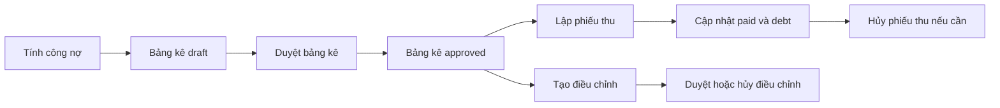

Đây là trang bắt đầu cho nghiệp vụ công nợ và thanh toán. Chọn công việc cần thực hiện trong bảng dưới đây; mỗi trang con trình bày điều kiện, các bước, kết quả và lỗi có thể gặp.

## Quy trình tổng quát

## Danh sách công việc

| Công việc | Kết quả được source xác nhận |
| --- | --- |
| [Tính công nợ](/finance/calculate-billing) | Tạo bảng kê nháp và dòng phí |
| [Duyệt bảng kê](/finance/approve-bill) | Chuyển bảng kê sang `approved` |
| [Lập phiếu thu](/finance/create-receipt) | Phân bổ tiền thu, cập nhật công nợ và ghi sổ |
| [Tạo điều chỉnh](/finance/create-adjustment) | Tạo bản nháp; chưa đổi công nợ |
| [Duyệt điều chỉnh](/finance/approve-adjustment) | Áp dụng thay đổi vào dòng phí và công nợ |
| [Hủy điều chỉnh](/finance/cancel-adjustment) | Hoàn tác điều chỉnh đã duyệt khi không có phụ thuộc chặn |
| [Hủy phiếu thu](/finance/cancel-receipt) | Đảo phân bổ và các bút toán liên quan |
| [Gửi nhắc công nợ](/finance/send-debt-reminders) | Xem trước, đưa email vào hàng đợi và xử lý kết quả gửi |

## Trạng thái chính

| Đối tượng | Trạng thái được workflow sử dụng |
| --- | --- |
| Bảng kê | `draft`, `waiting_confirmation`, `approved`, `partially_paid`, `paid` |
| Phiếu thu | `posted`, `cancelled` |
| Điều chỉnh | `draft`, `approved`, `cancelled` |

Xem [Vòng đời trạng thái](/product-specs/state-machines) để tra transition đã được source xác nhận.
