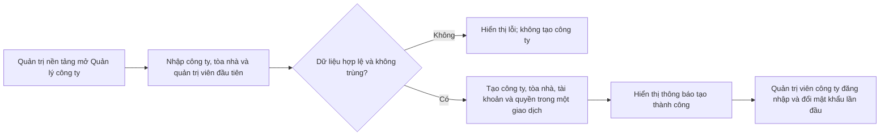

Bạn có thể tạo một công ty cùng tòa nhà đầu tiên và tài khoản quản trị công ty trên màn hình **Quản lý công ty**. Thao tác này dành cho tài khoản quản trị nền tảng đã đăng nhập và hoàn tất đổi mật khẩu lần đầu.

## Các bước thực hiện

<Steps>
  <Step title="Mở Quản lý công ty">
    Đăng nhập bằng tài khoản quản trị nền tảng. Nếu hệ thống yêu cầu, hoàn tất màn hình **Đổi mật khẩu lần đầu** trước khi tiếp tục.
  </Step>
  <Step title="Nhập thông tin công ty và tòa nhà đầu tiên">
    Trên màn hình **Quản lý công ty**, nhập **Mã công ty**, **Tên công ty**, **Mã tòa nhà đầu tiên** và **Tên tòa nhà**. Mỗi mã dùng chữ thường, số hoặc dấu gạch ngang; tối đa 64 ký tự.
  </Step>
  <Step title="Nhập quản trị viên đầu tiên">
    Nhập **Tên quản trị viên**, **Email quản trị viên** và **Mật khẩu ban đầu**. Mật khẩu cần ít nhất 12 ký tự, có chữ và số.
  </Step>
  <Step title="Tạo công ty">
    Chọn **Tạo công ty**. Khi thành công, màn hình hiện **Đã tạo công ty thành công** và danh sách công ty cập nhật số tòa nhà, tài khoản.
  </Step>
</Steps>

Tài khoản quản trị viên vừa tạo phải đổi mật khẩu khi đăng nhập lần đầu. Sau đó, họ có thể [thêm tòa nhà khác](/operations/add-tower) trong phạm vi công ty của mình.

<Warning>
  Nếu mã công ty, mã tòa nhà hoặc email quản trị viên đã tồn tại, hệ thống từ chối tạo. Dữ liệu không hợp lệ cũng bị từ chối trước khi ghi.
</Warning>

<Accordion title="Dành cho kỹ thuật">
  Giao diện ở `app/platform/organizations/page.tsx` gửi tới `POST /platform/organizations/onboard`. Handler kiểm tra phiên và phạm vi `platform`, rồi gọi `src/modules/organizations/organization-onboarding.ts`. Service xác thực tài khoản `platform-admin`, kiểm tra dữ liệu, sau đó tạo `Organizations`, `Towers`, `Users`, `AuthUsers`, nhóm quyền, các liên kết quyền và tòa nhà, `OrganizationAuditLogs` cùng `OrganizationOnboardingRequests` trong một Prisma transaction. `idempotencyKey` cho phép gửi lại cùng yêu cầu mà không tạo bản ghi trùng; cùng khóa với dữ liệu khác bị từ chối.
</Accordion>
