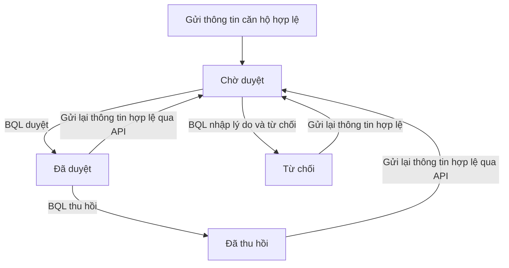

Bạn mở **Căn hộ - cư dân** → **Duyệt truy cập cư dân** để duyệt, từ chối hoặc thu hồi liên kết căn hộ của tài khoản Zalo. Bạn cần quyền truy cập màn hình này; danh sách và thao tác được giới hạn theo tòa nhà đang chọn.

## Duyệt hoặc từ chối yêu cầu

<Frame caption="Giao diện duyệt yêu cầu truy cập Mini App của cư dân theo tòa nhà">
  
</Frame>

<Steps>
  <Step title="Chọn yêu cầu đang chờ">
    Chọn **Chờ duyệt**. Tìm theo tên, Zalo ID hoặc căn hộ và kiểm tra dòng yêu cầu.
  </Step>
  <Step title="Quyết định quyền truy cập">
    Chọn **Duyệt** để cấp quyền cho yêu cầu đang chờ. Nếu không duyệt, chọn **Từ chối**, nhập **Lý do từ chối yêu cầu** rồi chọn **Xác nhận từ chối**.
  </Step>
  <Step title="Kiểm tra kết quả">
    Trang tải lại sau khi lưu. Yêu cầu chuyển sang **Đã duyệt** hoặc **Từ chối**. Khi cư dân tải lại dữ liệu, Mini App đọc trạng thái liên kết mới; lý do từ chối được hiển thị cho cư dân.
  </Step>
</Steps>

## Tình huống thực tế

> **Ví dụ:** Cư dân gửi yêu cầu truy cập căn hộ `A0101` từ Zalo Mini App:
> 1. Nhân viên mở màn hình **Duyệt truy cập cư dân** (tab **Chờ duyệt**).
> 2. Đối chiếu số điện thoại và tên cư dân với danh sách thành viên căn hộ `A0101`.
> 3. Nếu đúng thông tin: Bấm nút **Duyệt**. Trạng thái chuyển sang `Đã duyệt`, cư dân có thể tra cứu hóa đơn và gửi phản ánh ngay trên Mini App.
> 4. Nếu không đúng (ví dụ căn hộ chưa có hợp đồng): Bấm nút **Từ chối**, nhập lý do: *"Chưa có thông tin hợp đồng thuê căn hộ"* để phản hồi lại cho cư dân.

<Info>
  Duyệt liên kết chỉ cấp quyền truy cập Mini App. Thao tác này không tự tạo hồ sơ cư dân hoặc quan hệ cư dân–căn hộ. Cột **Đối chiếu hồ sơ** không chứng minh hồ sơ đã được gắn vào liên kết sau khi duyệt.
</Info>

## Thu hồi quyền

<Steps>
  <Step title="Chọn quyền đã duyệt">
    Chọn **Đã duyệt**, tìm liên kết cần xử lý rồi chọn **Thu hồi**.
  </Step>
  <Step title="Kiểm tra trạng thái">
    Sau khi trang tải lại, liên kết có trạng thái **Đã thu hồi**. Request đọc tiếp theo không chọn liên kết này làm căn hộ được phép xem; request tạo ý kiến cũng yêu cầu liên kết đang được duyệt.
  </Step>
</Steps>

Thu hồi không xóa hồ sơ cư dân, membership hoặc các chứng từ. Nội dung đã tải về trước đó không bị thao tác này tự xóa khỏi bộ nhớ giao diện.

## Các trạng thái liên kết

| Trạng thái lưu | Ý nghĩa |
| --- | --- |
| `pending` | Yêu cầu đang chờ; chưa cấp quyền vào căn hộ. |
| `approved` | Có thể được chọn làm căn hộ đang xem trong portal. |
| `rejected` | Yêu cầu bị từ chối; có lý do công khai. |
| `revoked` | Quyền đã bị thu hồi; không còn trong các căn được duyệt. |

API gửi liên kết dùng cùng một bản ghi cho tài khoản Zalo và căn hộ. Gửi lại đặt bản ghi về `pending`. Giao diện portal đã duyệt hiện chỉ có bộ chọn căn đã duyệt; giới hạn gửi liên kết căn thứ hai được nêu tại [Tình trạng tính năng](/reference/release-status).

## Cư dân thấy gì sau khi được duyệt?

| Màn hình Mini App | Nội dung hiện có |
| --- | --- |
| **Trang chủ** | Dư nợ từ danh sách bảng kê được trả về, thông báo đầu tiên và yêu cầu gần đây. |
| **Bảng kê** | Bảng kê `approved`, `partially_paid`, `paid`; có thể mở các dòng phí và số còn phải thu. Có danh sách phiếu gần đây, loại phiếu đã hủy hoặc đã xóa bị loại khỏi API. |
| **Yêu cầu** | Danh sách ý kiến và yêu cầu được tạo với cùng định danh Zalo; form **Gửi ý kiến cư dân** nhận tiêu đề và nội dung. |
| **Cá nhân** | Thông tin hiển thị của tài khoản, các căn đã duyệt và metadata cẩm nang. |

<Warning>
  API lấy tối đa 24 bảng kê rồi cộng nợ từ tập này. **Dư nợ hiện tại** chưa được tính bằng truy vấn tổng hợp toàn bộ bảng kê của căn hộ. Không dùng con số này để nghiệm thu tổng nợ cho trường hợp có nhiều hơn 24 bảng kê hợp lệ.
</Warning>

<Accordion title="Dành cho kỹ thuật">
  `ResidentMiniappLinks` lưu quyền giữa định danh Zalo và căn hộ; quyền này khác với `ResidentApartmentMemberships`, tức quan hệ cư dân–căn hộ.

  - Giao diện duyệt gọi `POST /admin/resident-miniapp/action` → `reviewResidentMiniappLink()` → transaction cập nhật liên kết và `AuditLogs`. Handler kiểm tra same-origin, phiên, route và tòa nhà.
  - Mini App gửi `request_access` hoặc `create_request` tới `POST /api/resident/portal`; đọc bằng `GET /api/resident/portal`.
  - Portal chọn liên kết `approved` khớp `apartmentId`. Nếu ID không khớp, source chọn liên kết được duyệt đầu tiên thay vì trả lỗi 403.
  - Danh sách yêu cầu lọc `miniapp_zalo_user_id`, tòa nhà và mã căn hộ; không dùng số điện thoại làm điều kiện xác định người tạo.
  - Trong production, API yêu cầu token phiên. Xác minh Zalo hiện trả `verifiedPhone` rỗng; luồng xin quyền số điện thoại không được tìm thấy trong giao diện hiện tại.
</Accordion>

Xem nhóm testcase `MINI`, `GAP` và `REL` tại [Chỉ mục testcase](/reference/manual-testcases). Việc có handler không xác nhận kết nối Zalo và trải nghiệm trên thiết bị thật đã đạt nghiệm thu.
