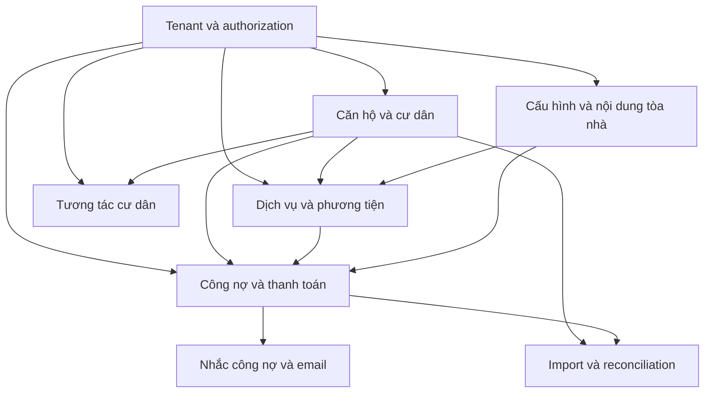
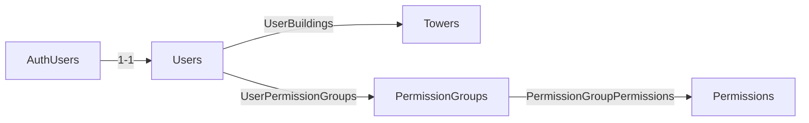
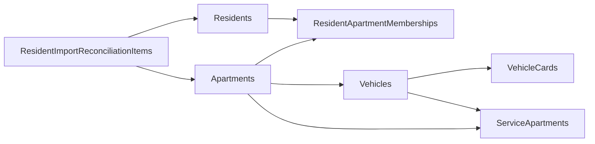
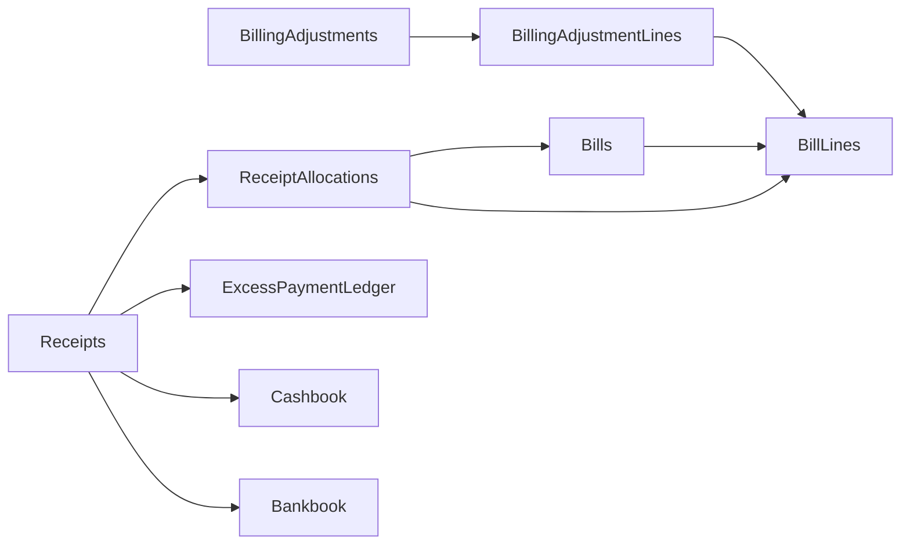
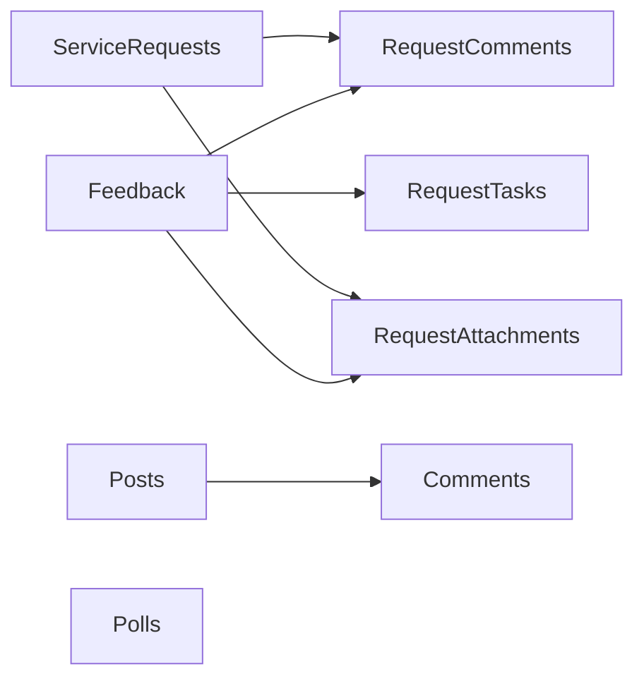
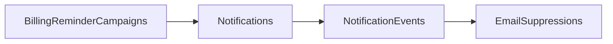

Trang này mô tả các nhóm behavior mà current executable source đang thực hiện. “Domain” ở đây là cách nhóm code và dữ liệu đã quan sát được; không phải kiến trúc dự kiến hoặc bounded context được suy đoán.

<Info>
  Chọn một domain để biết nó sở hữu dữ liệu nào và workflow dừng ở đâu. Chọn [Data dictionary](/reference/data-dictionary) khi cần field, type, nullability, default, relation hoặc index của một model cụ thể.
</Info>

## Bản đồ domain hiện tại

| Domain | Câu hỏi domain trả lời | Trạng thái hiện tại |
| --- | --- | --- |
| Tenant và authorization | User được vào tower nào và thực hiện action nào? | `Implemented`; không có permission riêng theo từng tower |
| Căn hộ và cư dân | Căn hộ, cư dân và quan hệ cư trú được lưu thế nào? | `Implemented` qua membership workflow |
| Dịch vụ và phương tiện | Dịch vụ nào áp dụng cho căn hộ/xe và chỉ số nào được ghi nhận? | Có luồng gán dịch vụ, phương tiện và ghi chỉ số |
| Công nợ và thanh toán | Bảng kê, thu tiền, điều chỉnh và sổ quỹ thay đổi ra sao? | Core audited workflows `Implemented`; có legacy report models |
| Tương tác cư dân | Feedback/request, phản hồi, file và task được xử lý thế nào? | `Implemented` cho feedback/request workflow; một số model chỉ có generic surface |
| Nhắc công nợ và email | Người nhận được preview, queue, gửi và cập nhật delivery thế nào? | Manual dispatcher `Implemented`; automatic scheduler `Not Found` |
| Import và reconciliation | File được preview rồi commit vào workflow nào? | `Implemented`; resident import dừng ở reconciliation trước khi resolve |
| Cấu hình và nội dung | Danh mục/config nào được quản lý? | Có luồng lưu dữ liệu cho các danh mục được liệt kê bên dưới |

## Tenant và authorization

### Trách nhiệm hiện tại

- Xác thực `AuthUsers` bằng email/password.
- Liên kết account với một employee `Users`.
- Lấy tower assignments từ `UserBuildings`.
- Hợp nhất permission từ các group của user.
- Chọn một `activeTowerId` cho request hiện tại.

| Model | Vai trò được code sử dụng |
| --- | --- |
| `Towers` | Tenant vận hành và parent relation của phần lớn dữ liệu quản trị |
| `AuthUsers` | Login identity, password hash, role, status và authorization source |
| `Users` | Employee profile liên kết account, tower và permission group |
| `UserBuildings` | Danh sách tower được phép; nguồn của `allowedTowerIds` |
| `PermissionGroups` | Nhóm permission global, không có `tower_id` |
| `Permissions` | Stable identifier cho route, CRUD hoặc workflow action |
| `UserPermissionGroups` | Gán nhiều group cho một user |
| `PermissionGroupPermissions` | Gán nhiều permission cho một group |

Grouped authorization được resolve lại từ database cho mỗi authenticated request. Xem đầy đủ rule, mismatch và Acceptance Criteria tại [Permissions matrix](/product-specs/permissions-matrix).

## Căn hộ, cư dân và phương tiện

### Trách nhiệm hiện tại

- Lưu căn hộ và hồ sơ cư dân trong active tower.
- Biểu diễn quan hệ cư trú bằng membership thay vì chỉ dựa vào text field trên resident/apartment.
- Cho một resident liên kết nhiều apartment và một apartment có nhiều resident.
- Lưu phương tiện thuộc apartment và đồng bộ dịch vụ phương tiện tương ứng.
- Đưa resident import vào hàng reconciliation trước khi tạo/gắn resident.

| Model | Vai trò được code sử dụng |
| --- | --- |
| `Apartments` | Căn hộ trong tower; được financial, resident, vehicle và report workflows tham chiếu |
| `Residents` | Hồ sơ cư dân trong tower |
| `ResidentApartmentMemberships` | Quan hệ resident–apartment cùng `relationship_code` |
| `ResidentImportReconciliationItems` | Một dòng resident import chờ resolve, reject hoặc gắn với record hiện có |
| `Vehicles` | Phương tiện gắn apartment; create/update đi qua specialized workflow |
| `VehicleCards` | Record thẻ xe có thể được vehicle tham chiếu |

Composite relations chứa `tower_id` ngăn membership hoặc vehicle relation trỏ sang record của tower khác. Generic create resident và generic vehicle mutations bị chặn; handler chuyên biệt là write path hiện tại.

## Dịch vụ, assignment và chỉ số

### Trách nhiệm hiện tại

- Khai báo dịch vụ của tower.
- Gán dịch vụ cho apartment; assignment có thể tham chiếu vehicle.
- Ghi meter reading theo apartment, service và period.
- Cung cấp service assignment và reading cho billing calculation.

| Model | Vai trò được code sử dụng |
| --- | --- |
| `Services` | Định nghĩa dịch vụ, service type và dữ liệu giá được billing code đọc |
| `ServiceApartments` | Assignment của service cho apartment; có effective period, status và optional vehicle |
| `MeterReadings` | Chỉ số đầu/cuối, lượng dùng, kỳ và metadata ảnh bằng chứng |
| `Vehicles` | Nguồn assignment cho dịch vụ có `service_type = vehicle` |
| `Partners` | Danh mục đối tác có generic admin route; quan hệ nghiệp vụ khác: `Not confirmed by current source code.` |
| `CycleLocks` | Trạng thái mở/khóa của kỳ mà financial và import workflows kiểm tra |

Billing code chỉ tạo dòng phí từ active apartment, active service và assignment đang áp dụng. Với metered service, code tìm reading cùng apartment/service/period.

## Công nợ và thanh toán

### Trách nhiệm hiện tại

- Tạo bảng kê và dòng phí ở trạng thái nháp.
- Duyệt bảng kê trước khi thu.
- Tạo phiếu thu với explicit allocations.
- Cập nhật `paid`, `debt` và status trong transaction.
- Tạo/cancel adjustment, receipt và excess movements theo guard của service.
- Ghi cashbook/bankbook và audit log khi workflow chỉ định.

| Nhóm model | Vai trò được code sử dụng |
| --- | --- |
| `Bills`, `BillLines` | Bảng kê tổng và các dòng phí; nguồn chính của current debt report |
| `BillingAdjustments`, `BillingAdjustmentLines` | Điều chỉnh tham chiếu source bill/line; draft chưa đổi debt |
| `Receipts`, `ReceiptAllocations` | Phiếu thu/chi và phân bổ tiền vào bill line |
| `ExcessPaymentLedger` | Movement tăng/giảm tiền thừa của apartment |
| `Cashbook`, `Bankbook` | Entry theo payment method khi tạo/cancel voucher |
| `ReceiptCategories`, `PaymentCodes` | Danh mục hỗ trợ form và validation thu/chi |
| `AccountingTransactions` | Record được financial import workflow ghi |
| `AuditLogs` | Before/after summary cho các workflow có audit implementation |
| `Debits` | Nguồn debt report tương thích cũ khi không có workflow bills |
| `ExcessPayments` | Route/table tồn tại; allocation workflow hiện ghi `ExcessPaymentLedger`, không ghi model này |

<Warning>
  `Debits` là fallback legacy cho báo cáo công nợ. Source đánh dấu nguồn này chỉ dùng đối chiếu, không hỗ trợ kỳ lịch sử hoặc gửi reminder. `ExcessPayments` tồn tại trong schema/admin surface, nhưng current excess workflow được tìm thấy sử dụng `ExcessPaymentLedger`.
</Warning>

Xem flow và AC tại [Workflow specifications](/product-specs/workflow-specifications), transition tại [State machines](/product-specs/state-machines).

## Tương tác cư dân

### Trách nhiệm hiện tại

- Tạo feedback hoặc service request trong active tower.
- Lưu phản hồi và attachment theo subject type.
- Đổi trạng thái request.
- Tạo/hoàn thành task cho feedback.
- Tổng hợp interaction report từ các model nguồn hiện tại.

| Nhóm model | Vai trò được code sử dụng |
| --- | --- |
| `Feedback`, `ServiceRequests` | Hai subject chính của resident request workflow |
| `RequestComments`, `RequestAttachments` | Trao đổi và file gắn feedback hoặc service request |
| `RequestTasks` | Task create/complete được tìm thấy cho feedback |
| `Posts`, `Comments`, `Polls` | Nội dung và tương tác có admin routes/generic persistence |
| `FeedbackForms` | Form configuration có specialized route/action check |
| `Repairs` | Hồ sơ sửa chữa có validation và attachment download path |
| `AppRatings` | Một nguồn của current interaction aggregate builder |
| `ServiceRatings` | Admin route/table tồn tại; current interaction aggregate builder không đọc model này |
| `InteractionReports` | Admin route/table tồn tại; current aggregate builder tính từ source models thay vì đọc model này |

`buildInteractionReport()` hiện đọc `Posts`, `Comments`, `Feedback`, `ServiceRequests` và `AppRatings`. Việc có `InteractionReports` hoặc `ServiceRatings` trong schema không chứng minh các model đó được dùng làm nguồn cho report builder này.

## Nhắc công nợ và email

### Trách nhiệm hiện tại

- Preview apartment/resident đủ điều kiện từ workflow debt source.
- Tạo campaign và email jobs bằng snapshot hash.
- Dispatcher kiểm tra lại debt, contact consent và suppression trước khi gửi.
- Webhook lưu provider event, cập nhật job/campaign status và tạo suppression khi cần.

| Model | Vai trò được code sử dụng |
| --- | --- |
| `BillingReminderCampaigns` | Snapshot, request id, recipient counts và derived campaign status |
| `Notifications` | Một job email cho recipient/apartment trong campaign |
| `NotificationEvents` | Provider event đã verify và deduplicate |
| `EmailSuppressions` | Email bị chặn gửi lại sau complaint, suppression hoặc hard/permanent bounce |

Manual dispatcher và webhook là `Implemented`. Automatic scheduler gọi dispatcher: `Not Found`.

## Import và reconciliation

### Trách nhiệm hiện tại

- Parse file theo route/module.
- Lưu preview và lỗi theo dòng.
- Chỉ commit preview còn pending, hợp lệ và thuộc active tower/route.
- Dùng specialized transaction cho financial import.
- Chuyển resident import sang reconciliation thay vì tạo resident trực tiếp.

| Model | Vai trò được code sử dụng |
| --- | --- |
| `ImportHistory` | Route/module, preview payload, status, row count và commit time |
| `ImportErrors` | Row number, column và message của lỗi parse/validation |
| `ResidentImportReconciliationItems` | Queue xử lý duplicate/match cho resident rows |

Preview parse thành công không đồng nghĩa target tables đã được ghi. Xem [Import/export](/engineering/import-export) cho từng commit path.

## Cấu hình, nội dung và landing

Các model dưới đây có schema và admin/public surface được tìm thấy. Không suy ra quan hệ nghiệp vụ ngoài field, route và handler hiện tại.

| Model | Behavior được tìm thấy |
| --- | --- |
| `Buildings` | Generic admin CRUD cho thông tin project/building record; khác model tenant `Towers` |
| `Handbook` | Generic admin CRUD cho nội dung cẩm nang |
| `BuildingPlaces` | Generic admin CRUD cho phân khu/địa điểm |
| `AccountingAccounts` | Generic admin CRUD cho danh mục tài khoản hạch toán |
| `ReceiptForms` | Generic admin CRUD cho hình thức phiếu thu/chi |
| `Configs` | Generic admin CRUD cho record cấu hình tòa nhà |
| `LandingContacts` | Public contact handler validate rồi lưu contact và retention date |
