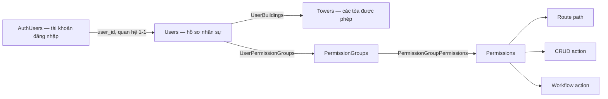
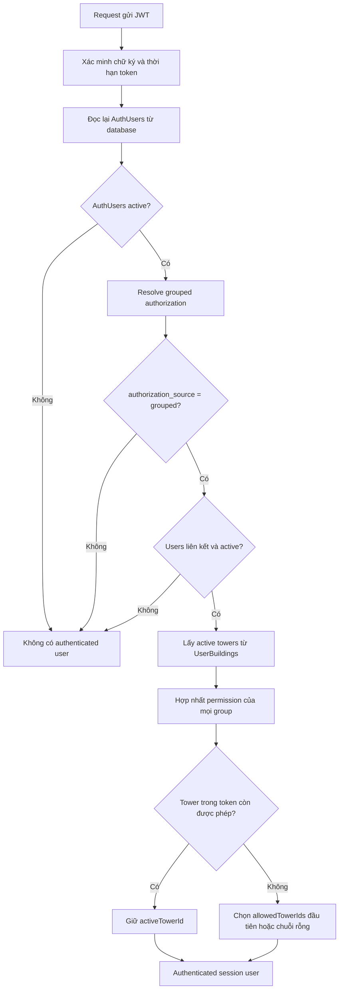
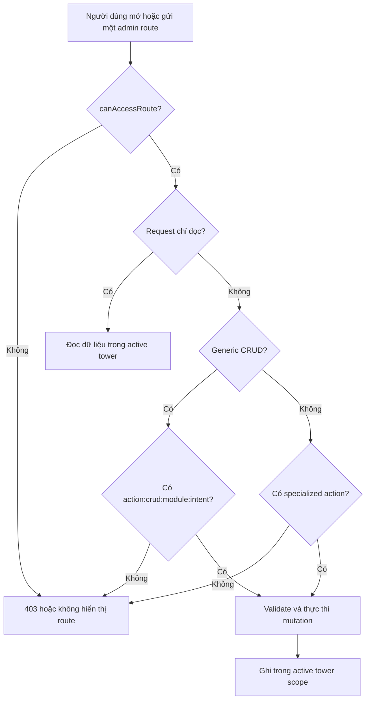

Trang này trả lời bốn câu hỏi:

1. Tài khoản nhận quyền từ đâu?
2. Server kiểm tra quyền nào khi mở màn hình hoặc gửi thao tác?
3. Tài khoản được làm việc với tòa nhà nào?
4. Code ngăn truy cập chéo tòa nhà ở đâu?

## Kết luận hiện tại

| Phạm vi | Trạng thái | Behavior được source chứng minh |
| --- | --- | --- |
| Grouped RBAC | `Implemented` | Quyền của operator được hợp nhất từ các permission group đang gán cho employee |
| Route, CRUD và workflow action | `Implemented` | Handler kiểm tra permission tương ứng trước mutation quan trọng |
| Chọn active tower | `Implemented` | Chỉ chọn được tower đang nằm trong `allowedTowerIds` của session đã resolve lại từ database |
| Application-level tenant scope | `Implemented` | Handler truyền `activeTowerId`; repository/service lọc và ghi theo `tower_id` |
| PostgreSQL Row-Level Security | `Not Found` | Không tìm thấy RLS policy trong schema hoặc migrations hiện tại |
| Permission riêng theo từng tower | `Not Found` | Một user có một tập permission hợp nhất dùng cho mọi tower được gán |

<Warning>
  Multi-tenant isolation hiện được thực thi bởi application code và quan hệ database. Không tìm thấy PostgreSQL Row-Level Security trong current source code.
</Warning>

## Mô hình gán quyền và tòa nhà



| Thành phần | Vai trò trong authorization |
| --- | --- |
| `AuthUsers` | Xác thực email/password, lưu role, status, liên kết tới một `Users` |
| `Users` | Hồ sơ nhân sự được gán tòa nhà và nhóm quyền |
| `UserBuildings` | Quan hệ nhiều-nhiều giữa user và tower; nguồn của `allowedTowerIds` |
| `PermissionGroups` | Nhóm quyền dùng chung; model không có `tower_id` |
| `UserPermissionGroups` | Quan hệ nhiều-nhiều giữa user và nhóm quyền; không có `tower_id` |
| `Permissions` | Catalog identifier ổn định trong field `route_name` |
| `PermissionGroupPermissions` | Quan hệ nhiều-nhiều giữa nhóm quyền và permission |

Vì `PermissionGroups` và `UserPermissionGroups` không có `tower_id`, source hiện áp dụng cùng một tập quyền cho tất cả tòa nhà trong `allowedTowerIds` của user.

## Quyền được resolve như thế nào?



Server không dùng role, permission hoặc tower claim trong JWT làm nguồn cuối cùng. Mỗi authenticated request đọc lại account và grouped authorization từ database. Test hiện có xác nhận role/tower claim bị sửa trong token không nâng được quyền.

### Quy tắc hợp nhất

- Permission từ nhiều group được hợp nhất theo phép union và loại trùng.
- Không tìm thấy explicit deny hoặc thứ tự ưu tiên giữa các group.
- `menuPermissions` chỉ gồm permission có `has_menu` truthy và identifier bắt đầu bằng `/admin`.
- Menu visibility và server authorization là hai kết quả riêng.
- Operator phải có `authorization_source = grouped`.
- `AuthUsers.permissions` và `AuthUsers.allowed_tower_ids` vẫn tồn tại trong schema, nhưng grouped resolution đọc quyền/tower từ các bảng quan hệ.

## Ba loại permission

| Loại | Identifier lưu trong `Permissions.route_name` | Hàm kiểm tra | Ví dụ |
| --- | --- | --- | --- |
| Route | Exact admin path | `canAccessRoute()` | `/admin/apartments` |
| CRUD | `action:crud:<module>:<intent>` | `canPerformCrudAction()` | `action:crud:apartments:update` |
| Workflow action | `action:<action>` | `canPerformAction()` | `action:approve_bill` |

`canPerformAction()` chấp nhận permission `*` như wildcard cho action. `canAccessRoute()` chỉ kiểm tra exact route path và không xử lý `*` như route wildcard.

### Route, menu và mutation



Nhìn thấy menu không chứng minh mutation được phép. Handler kiểm tra lại route và action/CRUD permission khi nhận request.

## Specialized workflow actions

| Action identifier | Behavior được bảo vệ |
| --- | --- |
| `action:calculate_billing` | Tính công nợ |
| `action:approve_bill` | Duyệt bảng kê |
| `action:update_bill_lines` | Sửa trực tiếp dòng phí được phép |
| `action:create_billing_adjustment` | Tạo phiếu điều chỉnh |
| `action:approve_billing_adjustment` | Duyệt phiếu điều chỉnh |
| `action:cancel_billing_adjustment` | Hủy phiếu điều chỉnh |
| `action:create_receipt` | Lập phiếu thu hoặc phiếu theo workflow được map |
| `action:cancel_receipt` | Hủy phiếu thu |
| `action:apply_excess` | Phân bổ tiền thừa |
| `action:send_debt_reminders` | Preview và queue email nhắc công nợ |
| `action:lock_period` | Khóa kỳ |
| `action:manage_feedback_forms` | UI và route policy yêu cầu action này, nhưng identifier đang thiếu khỏi stable permission catalog |
| `action:assign_user_access` | Gán account, tower và permission group |
| `action:set_user_active_state` | Khóa hoặc mở lại linked account |
| `action:reset_user_password` | Đặt lại mật khẩu user khác trong scope |
| `action:offboard_user` | Offboard user khác trong scope |
| `action:export_users` | Xuất danh sách user trong scope |

<Warning>
  Permission contract của `manage_feedback_forms` đang không đồng bộ. `app/admin/[[...slug]]/page.tsx` và `src/lib/admin-route-policy.ts` kiểm tra `action:manage_feedback_forms`, nhưng identifier này không có trong `ACTION_PERMISSION_NAMES` hoặc stable permission catalog. Vì `savePermissionGroup()` chỉ nhận identifier thuộc stable catalog, current group editor không thể thêm action này vào một group mới. `super-admin` vẫn vượt qua action check.
</Warning>

## Tenant scope theo tòa nhà

### Cách active tower được chọn

1. Grouped authorization chỉ lấy các tower có status `active` qua `UserBuildings`.
2. Khi tạo session, server giữ tower được yêu cầu nếu tower đó còn trong `allowedTowerIds`.
3. Nếu không còn hợp lệ, server chọn phần tử đầu tiên của `allowedTowerIds`; nếu danh sách rỗng thì dùng chuỗi rỗng.
4. `POST /auth/switch-tower` chỉ tạo session mới khi tower đích nằm trong `allowedTowerIds`.

### Enforcement path cho dữ liệu quản trị

```text
JWT
-> getSessionUser
-> resolveGroupedAuthorization
-> activeTowerId
-> route handler
-> createAdminRepository({ towerId: user.activeTowerId }) hoặc domain service
-> Prisma where/data có tower_id
-> PostgreSQL
```

| Operation ở generic repository | Tenant behavior hiện tại |
| --- | --- |
| List/search/count | Thêm `where.tower_id = repositoryTowerId` cho table có `tower_id` |
| Get by ID | Trả `null` nếu record thuộc tower khác |
| Create | Ghi đè input `tower_id` bằng tower của repository |
| Update/delete | Ném lỗi `Tower access denied` nếu record thuộc tower khác |
| Export | Dùng cùng list path đã scope theo tower |

Các domain service tài chính, resident, vehicle, reminder và import nhận `towerId` từ handler và tự thêm điều kiện tower vào query/mutation. Schema còn dùng composite relation có `tower_id` cho nhiều quan hệ resident, apartment, vehicle, bill và import để ngăn liên kết chéo tower ở database level.

## Quản trị RBAC

| Intent tại `POST /admin/rbac` | Permission bắt buộc | Scope check/side effect chính |
| --- | --- | --- |
| `save-permission-group` | Route nhóm quyền + CRUD create/update | Chỉ nhận permission ID có identifier trong stable catalog; thay toàn bộ group-permission links; ghi audit log |
| `save-user-assignments` | Route user + `action:assign_user_access` | Kiểm tra target user, towers, groups và actor scope; thay toàn bộ tower/group assignments; ghi audit log |
| `create-portal-user` | Route user + CRUD create + `action:assign_user_access` | Tạo employee, account role `operator`, tower/group links trong một transaction |
| `set-active-state` | Route user + `action:set_user_active_state` | Chặn tự khóa; đồng bộ status của `Users` và `AuthUsers` |
| `reset-user-password` | Route user + `action:reset_user_password` | Target user phải giao với actor tower scope, trừ `super-admin` |
| `offboard-user` | Route user + `action:offboard_user` | Chặn tự offboard; xóa assignments, đánh dấu employee `deleted`, account `inactive` |

Permission group là global trong schema. `actorTowerId` khi lưu group chỉ được dùng trong audit log; source không scope group theo tower.

## `super-admin`

`super-admin` bypass các hàm kiểm tra route, workflow action và CRUD action. Bypass này không tự mở rộng `activeTowerId`: session vẫn lấy `allowedTowerIds` từ `UserBuildings`, và switch tower vẫn yêu cầu tower đích nằm trong danh sách đó.

<Warning>
  Source hiện có một khác biệt trong workflow gán tower. `createPortalUser()` cho phép `super-admin` bỏ qua actor tower scope. `saveUserRbacAssignments()` nhận `actorIsSuperAdmin`, nhưng bước kiểm tra tower mới vẫn yêu cầu mọi tower nằm trong `actorTowerCodes`. Trong khi đó, dữ liệu UI cho `super-admin` liệt kê tất cả active towers. Tài liệu ghi nhận khác biệt này và không tự diễn giải behavior dự kiến.
</Warning>

## Acceptance Criteria hiện tại

| ID | Given — Bối cảnh | When — Hành động | Then — Kết quả được code thực thi |
| --- | --- | --- | --- |
| `AC-RBAC-01` | Account và employee đều `active`, source là `grouped` | Request được xác thực | Server hợp nhất permission từ các group và tower từ `UserBuildings` |
| `AC-RBAC-02` | JWT chứa role hoặc tower claim cao hơn database assignment | Request được xác thực lại | Server dùng role và tower assignment từ database; claim không nâng quyền |
| `AC-RBAC-03` | Operator có route nhưng thiếu CRUD/workflow action | Operator gửi mutation | Handler trả forbidden hoặc redirect kèm lỗi forbidden |
| `AC-TENANT-01` | Input create chứa `tower_id` khác active tower | Generic create được phép | Repository ghi active tower, bỏ qua tower override từ request |
| `AC-TENANT-02` | Record ID thuộc tower khác | Generic get/update/delete được gọi qua repository đã scope | Get trả `null`; update/delete bị từ chối |
| `AC-TENANT-03` | User yêu cầu switch sang tower ngoài `allowedTowerIds` | Gửi `POST /auth/switch-tower` | Server trả `403` và không tạo active session cho tower đó |
| `AC-RBAC-04` | Permission group nhận ID ngoài stable catalog | Lưu group | Service từ chối `invalid-permission` |

53 admin route policies nằm trong [Route catalog](/reference/route-catalog). Xem [Vai trò và phạm vi](/overview/roles-and-scope) cho cách người vận hành hiểu quyền; xem [Kiến trúc thực thi](/engineering/architecture) cho enforcement path dành cho developer.
