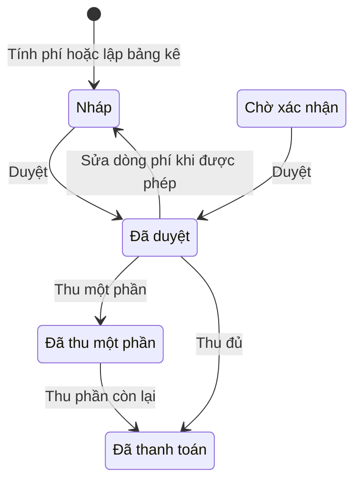
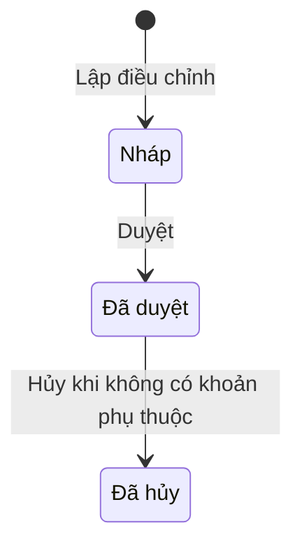
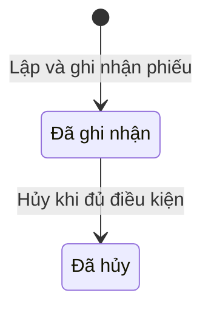
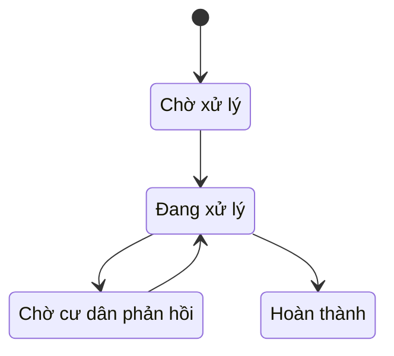
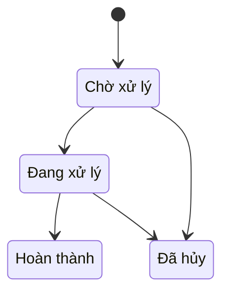

Trang này giải thích trạng thái của từng loại bản ghi. Giá trị trong dấu `code` là tên trạng thái được lưu; nhãn tiếng Việt cho biết ý nghĩa với người dùng.

## Bảng kê

| Trạng thái | Ý nghĩa khi tra cứu bảng kê |
| --- | --- |
| `draft` | Bảng kê nháp, chờ duyệt. |
| `waiting_confirmation` | Bảng kê đang chờ xác nhận; luồng duyệt cũng chấp nhận trạng thái này. |
| `approved` | Đã duyệt và có thể thu tiền vào các dòng phí hợp lệ. |
| `partially_paid` | Đã thu một phần, vẫn còn công nợ. |
| `paid` | Đã thanh toán hết số còn nợ. |

Trạng thái sau khi thu hoặc đảo khoản thu được tính lại từ số **đã thu** và **còn nợ**. Sơ đồ thể hiện các đường chính, không phải mọi kết quả khi hoàn tác một khoản thu.

<Warning>
  **Sửa trực tiếp dòng phí có điều kiện.** Khi dòng đã có phân bổ tiền thu hoặc điều chỉnh được duyệt, hệ thống chặn sửa trực tiếp.
</Warning>

## Điều chỉnh công nợ

| Trạng thái | Ý nghĩa với công nợ |
| --- | --- |
| `draft` | Mới lập, chưa tác động đến công nợ. |
| `approved` | Đã áp dụng thay đổi vào dòng phí và bảng kê; khoản giảm vượt số còn nợ có thể thành tiền thừa. |
| `cancelled` | Đã hoàn tác điều chỉnh được phép hủy. |

<Info>
  **Lập điều chỉnh nháp không đổi công nợ.** Công nợ thay đổi khi điều chỉnh được duyệt.
</Info>

<Warning>
  **Không thể hủy mọi điều chỉnh đã duyệt.** Hệ thống chặn hủy nếu điều chỉnh sau, khoản thu hoặc tiền thừa đã sử dụng phụ thuộc vào điều chỉnh này. Khi dữ liệu đã thay đổi trong lúc thao tác, bạn cần tải lại trước khi tiếp tục.
</Warning>

## Phiếu thu và phân bổ

| Trạng thái phiếu | Ý nghĩa nghiệp vụ |
| --- | --- |
| `posted` | Phiếu đã được ghi nhận vào hệ thống. |
| `cancelled` | Phiếu đã hủy; các tác động liên quan được đảo theo quy tắc hủy. |

<Warning>
  **Chỉ phiếu thu `posted` được hủy.** Kỳ hạch toán phải đang mở và không được có khoản phụ thuộc khiến việc hoàn tác không an toàn.
</Warning>

Phân bổ là bản ghi riêng với phiếu thu:

| Trạng thái phân bổ | Ý nghĩa nghiệp vụ |
| --- | --- |
| `posted` | Tiền phiếu thu đã được phân bổ vào dòng công nợ. |
| `excess_applied` | Tiền thừa đã được dùng để cấn trừ công nợ. |
| `reversed` | Khoản phân bổ đã bị đảo khi hủy phiếu liên quan. |

## Phản ánh và yêu cầu dịch vụ

<Warning>
  Sơ đồ dưới đây phản ánh source ứng viên ngày 30/09/2026. Migration và nghiệm thu phát hành chưa hoàn tất; xem [Tình trạng tính năng](/reference/release-status) trước khi dùng làm tiêu chí kiểm thử hệ vận hành.
</Warning>

Sơ đồ trên áp dụng cho phản ánh. Yêu cầu dịch vụ có các bước riêng:

| Loại | Trạng thái | Nhãn trên giao diện |
| --- | --- | --- |
| Phản ánh | `pending` | Chờ BQL xử lý |
| Phản ánh | `processing` | BQL đang xử lý |
| Phản ánh | `waiting_resident` | Chờ cư dân phản hồi |
| Phản ánh | `completed` | Đã hoàn thành |
| Yêu cầu dịch vụ | `pending` | Đang chờ |
| Yêu cầu dịch vụ | `processing` | Đang xử lý |
| Yêu cầu dịch vụ | `completed` | Hoàn thành |
| Yêu cầu dịch vụ | `cancelled` | Đã hủy |

<Info>
  Trong source ứng viên, trả lời hoặc tạo công việc khi phản ánh đang chờ sẽ chuyển sang `processing`. Trả lời sau khi đóng chỉ thêm trao đổi. Công việc tạo và hoàn thành chỉ áp dụng cho phản ánh.
</Info>

<Warning>
  Phản ánh còn công việc chưa hoàn thành không thể chuyển sang `completed`. `completed` của phản ánh và `completed`/`cancelled` của yêu cầu dịch vụ không có bước mở lại.
</Warning>

## Nhắc công nợ

Chiến dịch bắt đầu ở `queued`. Trạng thái tiếp theo được tính từ các công việc gửi email, không phải nút chuyển trạng thái thủ công.

| Trạng thái chiến dịch | Ý nghĩa |
| --- | --- |
| `queued` | Đã đưa vào hàng đợi. |
| `processing` | Đang xử lý công việc gửi. |
| `dispatched` | Đã gửi yêu cầu đi; kết quả giao cuối cùng còn phụ thuộc phản hồi. |
| `delivered` | Được ghi nhận đã giao. |
| `completed_with_failures` | Đợt gửi kết thúc nhưng có công việc thất bại. |

Các trạng thái từng công việc gửi được giải thích tại [Danh mục lỗi và trạng thái](/reference/error-status-catalog).

<Accordion title="Dành cho kỹ thuật">
  Luồng bảng kê, điều chỉnh và phiếu thu đi qua `app/admin/workflow/route.ts` tới các service trong `src/modules/billing`. Ma trận chuyển trạng thái phản ánh và yêu cầu dịch vụ ở `src/modules/requests/request-workflow.shared.ts`; thao tác ghi và audit ở `src/modules/requests/request-workflow.ts`. Trạng thái chiến dịch nhắc nợ được tính trong `src/modules/billing/debt-reminders.ts`.
</Accordion>
