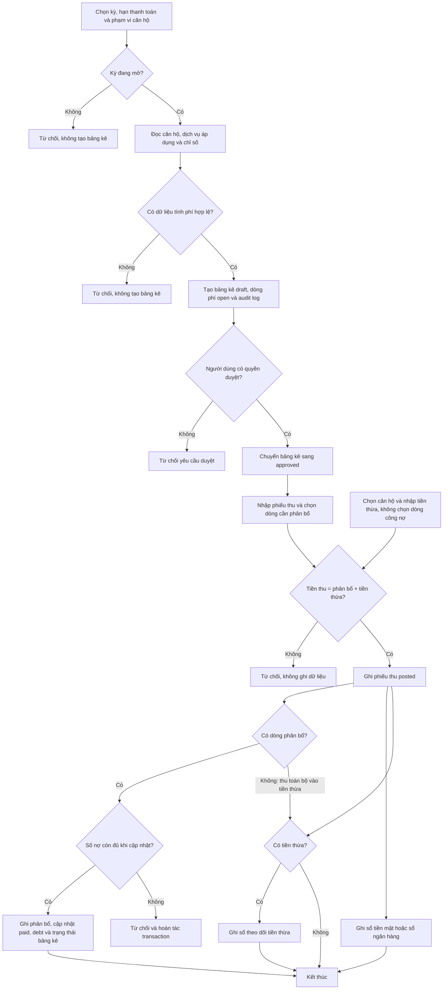
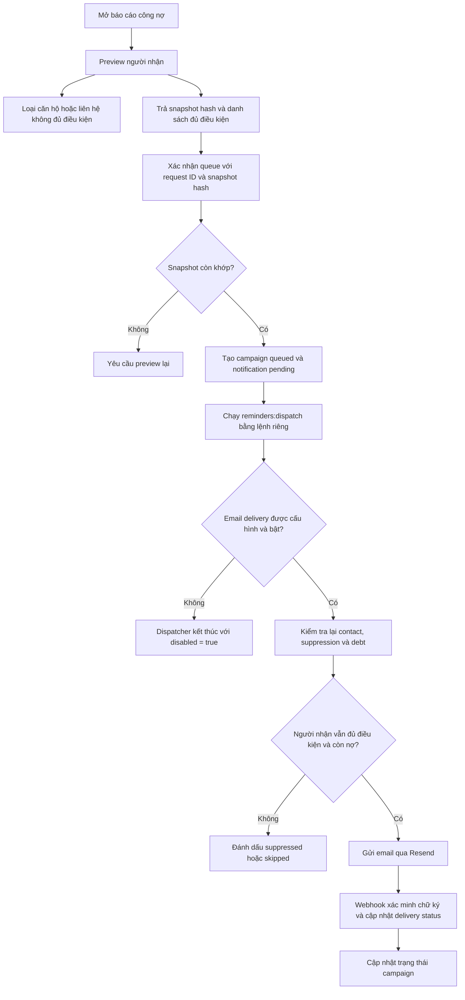
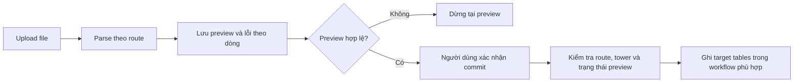
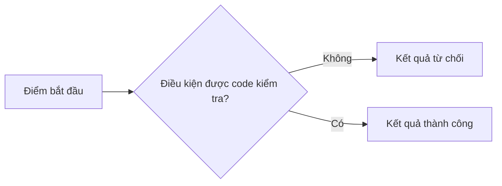

Trang này giúp PM, BA, QA và developer cùng đọc một workflow mà không phải bắt đầu từ tên hàm hoặc bảng dữ liệu.

Mỗi workflow quan trọng được trình bày theo cùng thứ tự:

1. **Sơ đồ** cho biết luồng đi qua đâu và dừng ở đâu.
2. **Dành cho PM / BA / QA** mô tả actor, User Story và Acceptance Criteria (AC).
3. **Dành cho Engineering** chỉ ra entry point, service, persistence và side effects.

<Info>
  Các User Story và AC dưới đây mô tả behavior đang có trong source code. Chúng không phải backlog hoặc đề xuất tính năng mới.
</Info>

## Use-case catalog

| ID | Use case | Trạng thái hiện tại | Đọc tiếp |
| --- | --- | --- | --- |
| `UC-AUTH-01` | Đăng nhập hệ thống quản trị | `Implemented` | [Vai trò và phạm vi](/overview/roles-and-scope) |
| `UC-RES-01` | Gắn cư dân với căn hộ | `Implemented` | [Căn hộ và cư dân](/operations/apartments-residents) |
| `UC-FIN-01` | Tạo và duyệt bảng kê | `Implemented` | Phần bên dưới |
| `UC-FIN-02` | Lập phiếu thu có phân bổ | `Implemented` | Phần bên dưới |
| `UC-FIN-03` | Tạo, duyệt hoặc hủy điều chỉnh công nợ | `Implemented` | [Công nợ và thanh toán](/operations/debt-payments) |
| `UC-REM-01` | Xem trước, xếp hàng và gửi nhắc công nợ bằng dispatcher | `Implemented` | Phần bên dưới |
| `UC-IMP-01` | Preview và commit import | `Implemented` | Phần bên dưới |
| `UC-LND-01` | Gửi thông tin liên hệ từ landing page | `Implemented` | [Route catalog](/reference/route-catalog) |

Catalog này liệt kê các workflow chuyên biệt đã được trace trong source. CRUD generic còn lại nằm trong [Route catalog](/reference/route-catalog).

## `UC-FIN-01` và `UC-FIN-02` — Tính và thu công nợ

**Phân loại:** `Implemented`

Workflow này tạo bảng kê nháp, duyệt bảng kê và ghi nhận phiếu thu có phân bổ cụ thể.



<Tabs>
  <Tab title="PM / BA / QA">
    ### User Story FIN-01 — Tạo và duyệt bảng kê

    Với vai trò người dùng có quyền tính và duyệt công nợ, tôi muốn tạo bảng kê từ dịch vụ đang áp dụng và chỉ số đã ghi nhận, để có bảng kê ở trạng thái cho phép thu tiền.

    **Điều kiện trước**

    - Tài khoản có quyền action tương ứng và truy cập được route liên quan.
    - Kỳ tính công nợ chưa khóa.
    - Căn hộ đang `active`.
    - Chưa có bảng kê khác không phải `cancelled` hoặc `deleted` cho cùng căn hộ và kỳ.

    **Acceptance Criteria**

    | ID | Given — Bối cảnh | When — Hành động | Then — Kết quả quan sát được |
    | --- | --- | --- | --- |
    | `AC-FIN-01` | Kỳ đang mở và có căn hộ, dịch vụ hoặc chỉ số hợp lệ | Người có quyền gửi yêu cầu tính công nợ | Hệ thống tạo bảng kê `draft`, các dòng phí `open` và audit log |
    | `AC-FIN-02` | Không có dịch vụ đang áp dụng hoặc chỉ số tạo được dòng phí | Người có quyền gửi yêu cầu tính công nợ | Hệ thống trả lỗi và không tạo bảng kê |
    | `AC-FIN-03` | Bảng kê là `draft` hoặc `waiting_confirmation` và kỳ chưa khóa | Người có quyền duyệt bảng kê | Bảng kê chuyển sang `approved`, lưu người duyệt, thời điểm duyệt và audit log |
    | `AC-FIN-04` | Bảng kê không còn ở trạng thái cho phép duyệt | Người dùng gửi yêu cầu duyệt | Hệ thống từ chối yêu cầu |

    ### User Story FIN-02 — Lập phiếu thu có phân bổ

    Với vai trò người dùng có quyền lập phiếu thu, tôi muốn chọn rõ số tiền phân bổ cho từng dòng công nợ, để hệ thống cập nhật số đã thu và số còn nợ trong cùng transaction.

    **Acceptance Criteria**

    | ID | Given — Bối cảnh | When — Hành động | Then — Kết quả quan sát được |
    | --- | --- | --- | --- |
    | `AC-REC-01` | Căn hộ `active`, kỳ hạch toán đang mở và các dòng thuộc bảng kê có thể thu | Người dùng gửi số tiền bằng tổng phân bổ cộng tiền thừa | Hệ thống tạo phiếu thu `posted`, tạo phân bổ, cập nhật `paid`/`debt`, ghi sổ và audit log |
    | `AC-REC-02` | Tổng tiền phân bổ cộng tiền thừa khác số tiền phiếu thu | Người dùng gửi phiếu thu | Hệ thống từ chối trước khi mở transaction ghi dữ liệu |
    | `AC-REC-03` | Một phân bổ lớn hơn số nợ hiện tại của dòng phí | Người dùng gửi phiếu thu | Hệ thống từ chối và transaction không lưu một phần kết quả |
    | `AC-REC-04` | Phiếu thu có số tiền thừa lớn hơn `0` | Phiếu thu được ghi thành công | Hệ thống tạo thêm một dòng trong sổ theo dõi tiền thừa |
    | `AC-REC-05` | Căn hộ đang hoạt động, kỳ mở, hình thức thu hợp lệ và các trường bắt buộc đầy đủ | Không chọn dòng công nợ, nhập tiền thừa dương rồi thu tiền | Tạo phiếu, ghi sổ, tiền thừa và audit log; không tạo phân bổ hoặc thay đổi công nợ |
    | `AC-REC-06` | Một dòng có số còn nợ dương | Nhập số thanh toán lớn hơn số còn nợ trên giao diện | Giao diện phân bổ tối đa bằng số còn nợ và chuyển phần vượt sang tiền thừa; server vẫn kiểm tra tổng tiền và phân bổ |
    | `AC-REC-07` | Số nợ giảm trước thao tác cập nhật dòng | Số nợ tại thời điểm cập nhật không còn đủ cho khoản phân bổ | Từ chối và hoàn tác transaction lập phiếu |

    Hướng dẫn theo từng màn hình: [Tính công nợ](/finance/calculate-billing) và [Lập phiếu thu](/finance/create-receipt).
  </Tab>

  <Tab title="Engineering">
    **Call path**

    ```text
    Financial form
    -> POST /admin/workflow
    -> permission by intent and return route
    -> calculateBillingPeriod / approveBill / createReceiptWithAllocation
    -> Prisma transaction
    -> financial tables and audit log
    ```

    | Intent | Service | Persistence chính | Side effects trong code |
    | --- | --- | --- | --- |
    | `calculate-billing` | `calculateBillingPeriod` | `Bills`, `BillLines` | Tạo `AuditLogs` |
    | `approve-bill` | `approveBill` | `Bills` | Tăng `version`; tạo `AuditLogs` |
    | `create-receipt` | `createReceiptWithAllocation` | `Receipts`, `ReceiptAllocations`, `Bills`, `BillLines` | Ghi `Cashbook` hoặc `Bankbook`; có thể ghi `ExcessPaymentLedger`; tạo `AuditLogs` |

    Handler kiểm tra session, active tower, route access và action permission trước khi gọi service. Service tài chính kiểm tra kỳ mở và thực hiện các thay đổi liên quan trong Prisma transaction.

    Với phiếu chỉ có tiền thừa, `allocationLines` là danh sách rỗng: không tạo `ReceiptAllocations` và không cập nhật `Bills` hoặc `BillLines`. Với phiếu có phân bổ, cập nhật dòng phí yêu cầu `debt >= allocated`; không so sánh phiên bản cũ, nên không phải mọi thay đổi đồng thời đều bị từ chối. Lỗi trong transaction hoàn tác cả phiếu, phân bổ và các bút toán liên quan.

  </Tab>
</Tabs>

## `UC-REM-01` — Gửi email nhắc công nợ

**Phân loại:** `Implemented` cho preview, queue, dispatcher chạy bằng lệnh và webhook. Automatic scheduler: `Not Found`.

Preview, tạo campaign, tạo notification job, dispatcher và webhook đều có implementation. Không tìm thấy automatic scheduler gọi dispatcher.



<Warning>
  Automatic scheduler: `Not Found`. Việc có dispatcher không chứng minh hệ thống tự chạy dispatcher theo lịch.
</Warning>

<Tabs>
  <Tab title="PM / BA / QA">
    ### User Story REM-01 — Xem trước và xếp hàng nhắc công nợ

    Với vai trò người dùng có quyền gửi nhắc công nợ, tôi muốn xem trước người nhận trước khi xác nhận, để campaign chỉ chứa các liên hệ còn đủ điều kiện tại thời điểm queue.

    **Acceptance Criteria**

    | ID | Given — Bối cảnh | When — Hành động | Then — Kết quả quan sát được |
    | --- | --- | --- | --- |
    | `AC-REM-01` | Người dùng có route access, action permission và active tower | Người dùng yêu cầu preview | Hệ thống trả danh sách đủ điều kiện, danh sách bị bỏ qua và `snapshotHash` |
    | `AC-REM-02` | Preview vẫn khớp dữ liệu hiện tại và có ít nhất một người nhận | Người dùng xác nhận queue | Hệ thống tạo campaign `queued`, notification jobs `pending` và audit log |
    | `AC-REM-03` | Công nợ hoặc người nhận đã đổi sau preview | Người dùng xác nhận bằng snapshot cũ | Hệ thống trả lỗi `preview-changed` và yêu cầu preview lại |
    | `AC-REM-04` | Dispatcher lấy một job đang chờ | Contact không còn hợp lệ, email bị suppress hoặc công nợ không còn dương | Job chuyển sang `suppressed` hoặc `skipped`; email không được gửi |
  </Tab>

  <Tab title="Engineering">
    **Call path khi queue**

    ```text
    DebtReportTable.client.tsx
    -> POST /admin/debt-reminders
    -> previewDebtReminders / queueDebtReminders
    -> BillingReminderCampaigns + Notifications + AuditLogs
    ```

    **Call path khi gửi**

    ```text
    npm run reminders:dispatch
    -> scripts/dispatch-billing-reminders.ts
    -> dispatchBillingReminders
    -> Resend API
    -> POST /webhooks/resend
    -> NotificationEvents + Notifications + EmailSuppressions
    ```

    Queue dùng `requestId` theo tower để xử lý lặp lại an toàn. Dispatcher kiểm tra lại người nhận và công nợ trước khi gửi, thay vì tin vào dữ liệu preview cũ.
  </Tab>
</Tabs>

## `UC-IMP-01` — Import dữ liệu

**Phân loại:** `Implemented`



File parse thành công không đồng nghĩa target tables đã được cập nhật. Preview và commit là hai bước riêng. Financial import kiểm tra preview thuộc route và tower hiện tại trước khi commit.

<Accordion title="Dành cho Engineering">
  Entry point là `POST /admin/import`. Financial import đi qua `commitFinancialImportPreview`; resident import đi qua reconciliation workflow. Generic và financial import không dùng chung toàn bộ persistence path.
</Accordion>

## Các workflow còn lại

| ID | Workflow | Trạng thái | Behavior hiện tại | Entry point |
| --- | --- | --- | --- | --- |
| `UC-AUTH-01` | Đăng nhập | `Implemented` | Tài khoản `active` gửi email/password; server resolve authorization rồi tạo cookie phiên | `POST /auth/login` |
| `UC-RES-01` | Membership cư dân | `Implemented` | Tạo cư dân cùng membership, gắn cư dân có sẵn, sửa hoặc xóa membership trong active tower | `/admin/resident-memberships` |
| `UC-FIN-03` | Điều chỉnh công nợ | `Implemented` | Tạo adjustment `draft`; chỉ khi approve mới cập nhật debt | `POST /admin/workflow` |
| `UC-LND-01` | Landing contact | `Implemented` | Validate request công khai rồi lưu contact hợp lệ với retention date | `POST /landing/contact` |

## Traceability hiện tại

| Use case | Rule | State | Permission / route | Persistence | Kiểm thử liên quan |
| --- | --- | --- | --- | --- | --- |
| `UC-AUTH-01` | `BR-AUTH-01` | — | `POST /auth/login` | Session cookie; authorization đọc từ RBAC tables | `test/auth-security.test.ts` |
| `UC-RES-01` | `BR-RES-01` | — | Resident CRUD và active tower | `Residents`, `ResidentApartmentMemberships` | `test/resident-membership-workflows.test.ts` |
| `UC-FIN-01` | `BR-FIN-01`, `BR-FIN-02` | `SM-FIN-01` | `calculate-billing`, `approve-bill` | `Bills`, `BillLines`, `AuditLogs` | `test/financial-workflows.test.ts` |
| `UC-FIN-02` | `BR-FIN-03`, `BR-FIN-04` | `SM-FIN-01`, `SM-FIN-03` | `create-receipt` | `Receipts`, allocations, bills, ledgers | `test/financial-workflows.test.ts` |
| `UC-REM-01` | `BR-REM-01`, `BR-REM-02` | `SM-REM-01` | Debt reminder route và dispatcher | Campaigns, notifications và notification events | `test/debt-reminder-integration.test.ts`, `test/resend-webhook.test.ts` |
| `UC-IMP-01` | `BR-IMP-01` | — | `POST /admin/import` | Preview/history; target tables tùy workflow | `test/import-spreadsheet.test.ts`, `test/resident-membership-workflows.test.ts` |
| `UC-LND-01` | Không có rule ID riêng | — | `POST /landing/contact` | `LandingContacts` | Direct route test: `Not Found` |

## Template use case dùng cho project

Không có một template bắt buộc cho mọi team. Với codebase này, template được chọn là User Story ngắn kết hợp AC theo Given / When / Then. Phần đầu cho PM thấy actor, hành động và kết quả. Phần AC cho QA và developer kiểm tra từng behavior quan sát được.

````mdx
## [Tên workflow]

**Phân loại:** `Implemented | Partial | Placeholder | Not Found`

### Mục tiêu hiện tại

[Một câu mô tả behavior được source code chứng minh.]

### Sơ đồ



<Tabs>
  <Tab title="Người vận hành">
    - Màn hình:
    - Điều kiện:
    - Các bước:
    - Kết quả nhìn thấy:
    - Lỗi và cách xử lý được source xác nhận:
  </Tab>
  <Tab title="BA / PM">
    - Actor:
    - User Story: Với vai trò [actor], tôi muốn [action], để [kết quả được source xác nhận].
    - Trigger:
    - Preconditions:
    - Main flow:
    - Alternative hoặc rejection flows:
    - Postconditions:
    - Business rule IDs:
  </Tab>
  <Tab title="Developer">
    - UI hoặc route:
    - Handler:
    - Service hoặc repository:
    - Transaction boundary:
    - Persistence:
    - Side effects:
    - Permission:
  </Tab>
  <Tab title="Tester">
    | ID | Given | When | Then | Kiểm thử liên quan |
    | --- | --- | --- | --- | --- |
    | `AC-01` | [bối cảnh được code kiểm tra] | [action thật] | [kết quả quan sát được] | [test file hoặc `Not Found`] |
  </Tab>
</Tabs>

````

<Note>
  Nếu phần “để” trong User Story không chứng minh được từ source, không tự điền product value. Dùng `Not confirmed by current source code.` cho phần chưa xác nhận.
</Note>

Mẫu này dựa trên cấu trúc User Story “As a / I want / so that” trong [hướng dẫn của Atlassian](https://www.atlassian.com/agile/project-management/user-stories) và cách tách bối cảnh, hành động, kết quả bằng Given / When / Then trong [Gherkin Reference của Cucumber](https://cucumber.io/docs/gherkin/reference/). Trong docs này, các từ khóa được hiển thị song ngữ để PM và developer cùng đọc được.

Xem [Business rules](/product-specs/business-rules) cho các điều kiện được server thực thi, [State machines](/product-specs/state-machines) cho transition và [Route catalog](/reference/route-catalog) cho inventory entry point.
